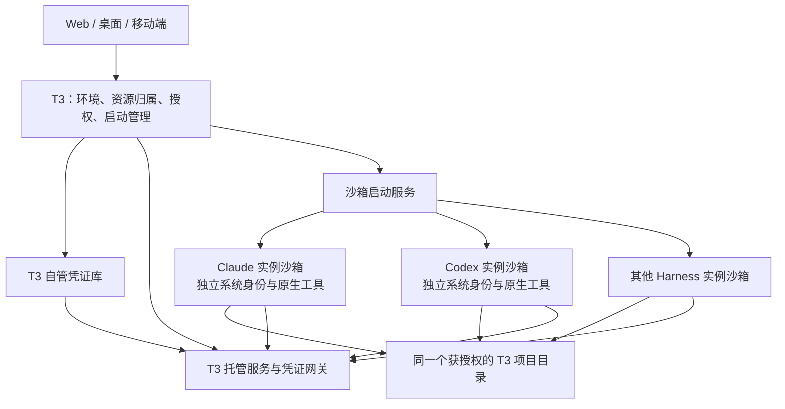

# Fork 架构：Harness 沙箱与 T3 资源管理

本文记录本 fork 的目标架构及其设计理由，作为后续实现和适配的共同约束。首期适配 Linux 上的 Claude、Codex 和 Grok，当前可用范围及宿主配置见[使用指南](../user/harness-sandbox.md)。其他平台和 Harness 的适配仍需遵循本文约束。

这里的 Harness 对应仓库术语中的 provider。项目和运行环境沿用[现有术语](./glossary.md)；“T3 用户”指一个 environment 的唯一资源所有者。运行 T3 的宿主 Linux 用户承接持久文件与托管服务的系统归属，各 Harness 实例使用独立的执行用户和厂商配置。

## 目的与使用前提

T3 是用户管理 Agent、项目、服务和凭证的图形化入口。它负责启动 Harness 并提供运行资源；模型推理和原生工具调度由 Harness 完成。

设计默认 Agent 是善意、获授权的协作者。用户希望通过界面填写凭证，让 Agent 能确认某项能力已经配置并获授权，然后直接使用。系统承担凭证处理，使用户无须通过 SSH 配置变量，也使 Agent 无须接收真实 Token、要求用户发送 Token，或判断如何保存 Token。

保护措施针对操作失误、错误回显、账户混用，以及漏洞或被利用的工具导致的越权。常见路径中的秘密值应与 Agent 操作分离，但不以 Agent 主动寻找办法窃取凭证为默认设计前提，也不承诺绝对隔离。授权空间内的误删不属于本项目新增护栏的目标；Agent 保留正常创建、读取、修改、删除和执行的能力。

厂商自身的登录凭据、认证流程及保护策略沿用官方工具，不属于此次升级的凭证托管范围。T3 仍需把不同实例的配置目录分开，避免选错账号；这不构成重新实现厂商认证的要求。

## 架构边界

| 责任                                             | 所属边界                             |
| ------------------------------------------------ | ------------------------------------ |
| 模型交互、原生工具调度、厂商认证                 | Harness                              |
| Bash、curl、文件操作、编译、启动项目程序         | 对应 Harness 的沙箱                  |
| 系统身份、挂载、工具环境、进程生命周期、出口配置 | T3 管理的运行基础设施                |
| 项目文件、个人空间、共享资源的归属与授权         | T3 用户                              |
| 自管 Token、变量库、服务凭证绑定                 | T3                                   |
| 需要自管凭证的 API 请求                          | 获授权的沙箱执行子进程或 T3 托管服务 |

普通工具执行保留在 Harness 沙箱。T3 提供和配置这个环境，包括可用软件、目录、普通变量及服务入口；执行命令的进程身份仍属于该 Harness。由 T3 管理资源，不意味着任意 Agent 命令能访问 T3 服务进程的全部权限或环境。

## 外部适配原则

Harness 适配优先使用操作系统隔离、启动参数、已有 SDK 和协议接口、受支持的配置方式，以及 T3 自己的服务入口。

目录、权限、出口和默认路径必须落实到真实运行环境。系统提示词不承担这些边界。普通开发操作继续使用原生 Bash、curl 和文件工具；不要求模型切换到自制的 curl 工具，也不要求把所有工具执行委托给 T3。

修改 Harness 源码或加载插件替换其内部实现不属于默认方案。确有必要时，应在采取之前向用户说明缺少什么外部能力、替代方式、修改范围及维护影响。支持 MCP 或 ACP 本身不证明需要修改 Harness，也不证明任意原生调用已经被 T3 接管。

变量模板、凭证元数据和服务管理属于新增能力，可以通过 T3 工具接口提供。接口应明确表达“已配置、已授权、调用不返回真实凭证”等事实，使 Agent 能正常使用用户授权的能力。这种接口说明不替代系统权限检查。

## 管理框架保护

当前 T3 启动的 Harness 可以维护获授权的业务项目及其发布服务。管理这些 Harness 的 T3 框架自身由独立维护环境管理；不向受其管理的 Harness 提供框架源码修改、构建替换、部署、发布、回滚或重启权限。只读的版本与能力信息可以用于诊断，不因此获得框架管理权限。

保护对象按宿主可信配置登记，包括当前框架对应的源码、运行包、发布目录、启动入口、systemd 单元、真实状态与秘密目录，以及相关沙箱、出口和代理管理配置。框架开发副本也不能因位于宽泛的共享父目录而自动成为业务工作区。应用发布、容器诊断、卷挂载和反向代理管理均不得修改或替换这些对象；改名、另选域名或提交其他项目 ID 不改变对象的保护属性。框架仓库及其自动发布工作流的写权限同样不随业务工具授权提供。

保护在挂载、项目范围检查和宿主执行入口中落实，路径解析后校验，必要时不挂载或以只读视图提供。宿主发布代理只控制由 T3 登记的业务应用，不接受任意宿主命令、Docker 对象、systemd 单元或整份 Caddy 配置作为操作目标。普通应用容器不获得 Docker 控制 socket、宿主管理目录、宿主进程或特权运行能力。管理边界优先于一般业务项目授权，不通过工具描述、模型记忆或模型自行判断实施。

## 身份与资源归属

一个 environment 由一个资源所有者管理，项目、个人空间、凭证和托管服务统一归其所有。GitHub 登录和配对用于认证访问该环境的客户端，沿用环境级访问权限。Agent 的服务调用再按已认证的会话、Harness 实例、thread 和具体服务权限检查；Agent 提交的标识不能扩大权限。

“每个 Harness 一个系统用户”按实例落实：同一个 T3 用户只有一个 Claude 账号时可以使用一个 Claude 执行用户；新增另一个 Claude 账号时使用另一个实例身份。现有的[实例路由约束](./providers.md#process-and-account-isolation)继续适用。

系统身份长期绑定实例。运行中的会话使用各自的进程和临时目录隔离，实例配置可以在同一账号的会话间按 Harness 需要复用。项目共享是显式授权；同一个用户的多个 Harness 可以访问同一项目，而私有配置、聊天状态和服务授权仍分别处理。

沿用[环境认证](./environment-auth.md)的资源空间，每个 environment 对应一个所有者。多个用户在同一 environment 中分别拥有隔离的项目、凭证和服务，不属于本项目目标。需要落实的隔离是 Harness 实例之间的系统身份、私有配置、挂载范围和服务权限。

## 共享文件与默认路径

项目属于 T3 用户，不绑定创建它的 Harness。Claude 和 Codex 使用同一个获授权的实际目录，切换 Harness 无须 fork、复制项目或重新准备一份工作空间。共享文件的并行修改属于用户授权范围。

文件归属包含两层含义：项目记录归所属 environment 管理；持久文件在宿主磁盘上归运行 T3 的宿主用户。Harness 的独立执行 UID 与磁盘所有者可以不同。

仅添加共享用户组或 ACL 能授予访问权限，但新文件通常仍属于创建进程的 UID。Linux 后端优先验证 idmapped mount，使各 Harness 能以自己的身份正常操作目录，同时保持宿主文件归属。其能力依赖目标内核、文件系统和运行时，不能静默退化为混合文件所有者；不支持时需要另行确定可接受的文件共享方案。[Linux idmapped mounts](https://docs.kernel.org/filesystems/idmappings.html)

个人空间映射到 Harness 的真实 HOME；项目会话的工作目录是项目根目录，个人空间会话的工作目录是个人空间。普通相对路径命令应直接产生预期结果。这里的 HOME 是 T3 用户获授权的文件视图，不是把服务器用户的整个主目录连同凭证一起开放。

沙箱路径与宿主路径的对应关系由 T3 管理，文件展示、附件和下载使用同一套映射。Harness 的持久配置放在实例专属位置，避免多个 Harness 的默认配置目录通过共享 HOME 意外合并。

## 沙箱与原生操作

第一套运行后端以 Linux 服务器为目标，使用支持 OCI 1.3 idmapped mount 的 runc。它按宿主预置的实例配置限制目录视图、进程视图和临时空间；不为每个 Harness 发明一套不同的沙箱。配置必须明确选择宿主网络或已配置路由的独立网络空间。宿主网络保留真实 UID 出口规则，也保留宿主端口可达性，不能作为网络隔离的证明。

服务器以普通身份管理业务。确需权限的用户配置、挂载和网络操作集中在受约束的启动服务中；Harness 沙箱不获得这个管理入口。

原生 shell 及其启动的 curl、Python、编译器和开发服务器都在该 Harness 的沙箱里执行，使用其真实执行 UID。原生文件工具也受相同挂载边界约束。T3 管理并记录运行生命周期；新机制不把后台命令默认提升为带凭证的宿主服务。

依赖和工具环境可以由 T3 统一供应，供多个 Harness 使用同一个项目。可复用内容与实例私有配置分开处理。会话环境应能连续执行命令，不为每条命令重建一套运行环境。

登录、探测、技能发现、额度查询和辅助生成同样需要使用正确的实例配置和网络上下文。它们不一定需要完整的项目挂载，但不能因走另一条启动路径而回到错误账号或默认出口。

## 变量库与凭证调用

变量库由环境的资源所有者通过图形界面创建、修改、替换和删除，支持文本、Token 及其他可扩展的值类型。Agent 可以创建输入模板，读取获授权的变量名称、长度、类型、配置状态和可调用能力。元数据查询与使用授权都按 Harness 实例过滤，未授权实例不能列出或使用变量。

秘密变量由 T3 加密保存，不作为模型上下文或普通配置返回。获授权的执行子进程可以得到真实环境变量，父 Harness 的模型认证环境保持独立；T3 保管一个值不能使已注入进程的环境变量不可读。

用户填写模板时，值从客户端直接提交到专用的凭证写入路径。会话只记录模板和配置结果。秘密值不能混入聊天消息、可重放的会话事件、普通请求日志或错误回显；存储和密钥材料使用独立的访问范围。脱敏属于补充措施，不承担对任意变形或编码都能识别的承诺。

临时使用 shell 变量时，Agent 查询凭证的名称、类型、长度和实例权限，通过 MCP 申请当前会话的使用权。返回“允许”之前，系统必须确认该实例具备可用的执行桥接。之后仍使用原生 shell 和 `$变量名`；本机执行桥接在 shell 启动时按会话授权解析真实值，值只进入执行子进程，不通过 MCP 或聊天返回，也不改变父 Harness 的模型登录环境。已由用户预先授权的常用工具采用下述工具绑定方式，凭证提供由系统自动完成。

### 保留 curl 使用方式

curl、Python、构建程序等仍在 Harness 沙箱内运行，并沿用实例出口。用户授权后，原生 shell 的启动入口为其子进程注入真实环境变量，例如 `curl -H "Authorization: Bearer $OPENAI_API_KEY"`。真实环境变量必然可被该执行进程读取；本设计接受这一点，针对正常操作和误回显提供保护，不宣称进程无法读到值。

变量不写入共享项目或实例的登录配置。Codex 等内层沙箱可能禁止创建 Unix socket，因此桥接提供按 MCP 会话凭证派生密钥、带有效期的 AES-GCM 授权文件。目录只读挂载，文件按 T3 用户私有权限保存，更新使用原子替换，发出“允许”之前等待文件发布完成；会话撤销时删除，启动入口在本地解密。该兼容路径不开放网络、写入权限或厂商内部实现。已注入值的原样 stdout/stderr 会被启动入口过滤，过滤可以跨输出分块；它不保证识别编码、截断、转换后的值。直接执行其他程序、已有进程的子进程及工具自建输出路径可能绕过 shell 输出过滤，这属于既定的实用边界。

使用授权绑定实例、会话和线程，默认十五分钟有效。撤销、删除、改值或改变权限会阻止后续新命令领取值；已经获得环境变量的运行进程不会被追溯清空。用户主动添加变量与 Agent 请求的私密输入模板使用相同写入接口，模板填写不成为聊天消息。输入工具在服务器等待表单保存或取消，返回元数据后继续 Harness 原有回合；等待不占用凭证库的修改锁，也不通过合成聊天消息启动另一个模型循环。

### 常用工具与 GitHub CLI

原版已有 GitHub CLI 接入，使用服务器上的 `gh` 认证进行仓库和 PR 操作，见[源码控制指南](../user/source-control.md)与 [GitHubCli](../../apps/server/src/sourceControl/GitHubCli.ts)。独立用户、HOME 和环境继承使 Harness 内的原生 `gh` 不再自然取得宿主登录状态；此处扩展已有认证的沙箱适配，沿用原生命令。GitHub 登录 T3 的身份验证与仓库操作授权分别管理，网页登录不能自动成为仓库操作许可。

用户将已连接的 GitHub 账号或凭证库变量绑定到 `gh`，明确允许使用的实例、GitHub host 和账号。T3 在经过绑定的原生工具启动入口提供相应凭证，普通 `gh pr list` 等命令无需模型再次列出、申请或定期续租 Token。工具执行仍使用该 Harness 的用户、目录和网络；真实凭证只提供给工具执行进程，不默认加入父 Harness 或所有 shell 的环境。绑定、内部授权续期及凭证更新由系统管理，撤销后后续启动停止领取；已运行进程的环境不能追溯清空。

绑定通过外部启动适配落实，保持原有参数、输入输出、退出码和网络语义，不解析任意 shell 文本来猜测凭证用途。宿主现有 `gh` 登录可作为明确选择且符合管理框架保护策略的凭证来源，不共享整份宿主 HOME、认证文件或其他账号配置；真实值不进入工具返回、诊断信息和普通日志。实际账号与 GitHub host 必须与绑定一致，失效、未配置、未授权分别报告，不自动尝试另一账号或环境。GitHub 允许的仓库和操作范围仍由其有效授权决定，T3 的实例绑定不能凭空收窄或扩大 GitHub Token 本身的权限。复用宿主登录时明确沿用原有 GitHub 权限，不声称仓库限制。管理框架的本机源码只读、配置隐藏及禁止发布保护独立实施，不构成远端 GitHub 仓库写权限限制。需要远端仓库范围控制时选择 GitHub App 授权。

Source Control 中 T3 自身的连接状态与 Harness 的工具绑定状态分别呈现。原版跨 environment 的 GitHub sharing 继续遵守已有显式授权，不自动转换为沙箱 shell 的凭证提供。沙箱通过无秘密的 Git command-scope 配置接入 GitHub HTTPS credential helper，仅认证时解析同一 gh 绑定。助手输出属于程序协议，不能在该管道替换密码：仅当 stdout 是已固定原生 Git HTTP transport 持有读端的管道时保留原值；stderr 仍遮蔽。用可执行文件身份和管道读端确认调用方，而不按进程名或命令名猜测，`gh auth git-credential` 的直接调用、`git credential fill` 和 Git shell alias 仍遮蔽秘密。其他托管平台和 SSH 认证不受该 helper 配置影响。未预先绑定的临时 API Key 保留 MCP 申请变量的流程。

`host-login` 复用资源所有者的已有 gh 登录；服务的数据 HOME 与登录 HOME 可以不同，认证配置按显式 GH_CONFIG_DIR、XDG 配置目录或系统用户 HOME 查找。每次原生启动重新取得当前凭证，账号验证可缓存五分钟；退出登录或凭证变化不能继续命中旧缓存。host-login 的仓库列表必须为空，避免误称原有授权已被限制。GitHub App 模式持续换取指定业务仓库的短期 Token，配置的仓库集合与 installation API 返回集合必须一致；App 私钥使用仅绑定用途，不能申请注入 shell。授权变化与凭证变化须等待本地文件桥接同步完成后返回，原生 AF_UNIX 受限的客户端也不能继续读旧绑定。解析工具凭证先取得凭证库锁，释放后再发布桥接文件；凭证库持锁同步 shell grants 时不反向解析工具凭证，以免形成锁循环。

## 托管第三方 MCP 与 API 服务

服务归属于 T3 用户，按授权提供给不同 Harness。服务可以采用 stdio MCP、HTTP MCP 或明确适配的 API，运行在 T3 管理的服务环境中，使用服务自己的依赖、执行身份和出口配置。

例如 NAI 服务安装在服务器的 dev 环境中，Claude 使用 claude-run 固定出口。T3 登记并管理 NAI 服务，Claude 通过获授权的入口调用它；Claude 无须迁移到 dev 身份，也无须获得 dev 的凭证目录。这个例子用于验证跨身份服务接入，整个架构适用于用户登记的各类服务。

服务程序、启动配置和凭证绑定由用户管理，与普通 Agent 可编辑的项目空间区分。T3 按用户配置的绑定为服务注入凭证；服务执行在 T3 环境，而授权 shell 执行仍在 Harness 沙箱，两种路径分别遵守实例权限。第三方 MCP 每个提供方会话拥有独立连接，stdio 服务由 T3 用户启动，HTTP 服务通过 T3 的连接访问。

沙箱访问 T3 时使用明确的服务入口与会话授权，不自动开放宿主全部端口或管理接口。网络空间中的 localhost 指向该空间自身，当前 MCP 的本机地址需要在外部启动配置中转换为可达入口；客户端浏览器的地址也不能代替服务器内部地址。禁止访问宿主地址的固定出口可用[私有 Unix socket 通道](../../scripts/sandbox/t3code-mcp-relay.py)连接两边的 loopback，保留已有路由与防直连规则；通道只提供到 T3 的连接，每次 MCP 请求仍验证实例会话凭证。

修改或撤销服务授权后，后续调用按新授权判断。长期连接和缓存不能使旧授权一直有效；配置变化也不能把已有会话重新绑定到另一个 Harness 实例或 environment。

## 业务服务发布与运维

“应用发布”表示将业务项目的一个确定版本交给 T3 长期运行，并建立可观察、可维护的应用记录。开发仍在 Harness 工作区进行，运行版本使用独立的构建快照和镜像；编辑开发文件不会直接改写已发布版本。应用归 T3 用户及项目管理，获授权的其他 Harness 可以维护同一应用，创建者实例只作为操作来源记录。

首个运行后端采用宿主 Docker Compose。Harness 编写标准 Dockerfile 和受支持的 Compose 声明；T3 校验项目、构建范围、挂载、运行身份和端口后生成受管理配置，由 Docker 负责容器运行及退出后的重启。Docker daemon、持久数据与运行实例的生命周期独立于聊天和 T3 前端服务，不因会话结束或 T3 服务重启而执行停止或删除。进程退出重启与健康检查分别记录，不能把 Docker 重启策略描述为对所有不健康状态自动恢复。

发布使用持久任务记录，返回可查询的阶段与结果。镜像、源码提交或内容快照、运行配置及凭证绑定版本与 release 关联；新版本通过健康检查后才切换公共入口。构建、启动、健康检查或路由切换失败时说明失败阶段，并按应用可用的更新策略保留或恢复旧版本。代码和配置回滚不自动回滚数据库与其他持久业务数据；不承诺任意多容器应用都支持零停机或无条件事务回退。

发布后 Harness 可以按应用授权查看状态、构建和运行日志、实际发布配置、退出原因、重启次数、历史版本及访问入口，并执行启动、停止、重启、重新发布、回滚和撤回。必要的运行时诊断仅进入指定业务容器，以其既定运行身份执行；不取得宿主命令入口。日志和诊断输出按需限量、可分页，并过滤绑定凭证的原样值。普通检查信息应足以关联真实运行版本及对应源码，不能引导 Agent 用当前开发副本猜测旧版本错误。

应用发布不必开放公网。公开访问时，T3 分配仅宿主可达的后端入口，并由 Caddy 提供独立域名；应用不能覆盖管理框架或其他受保护服务的入口。临时服务继续由 Harness 原生命令启动，沿用跨实例共享和 Caddy 路由接口；现有 `service_publish` 只开放临时公网路由，不能静默改变为构建、托管或重启进程。长期应用工具使用独立名称和契约。

### Agent 可见的使用契约

环境查询返回当前实例真实可用的目录、工具绑定、网络、发布能力与生命周期信息。发布和运维工具的描述明确前提、执行位置、所属范围、副作用及完成条件；返回值给出应用与 release 标识、任务阶段、真实可达入口及下一步。异步任务提交成功不称为发布成功，Docker daemon 状态、应用健康和 Caddy 路由状态分别报告。

缺少 Docker、未登记发布能力、凭证失效、权限不足和上游故障应有不同错误类别。失败不触发向其他账号、宿主 shell 或不同出口的静默回落；工具明确返回允许采取的下一步。工具说明通过原生 MCP 描述和 schema 提供，系统权限与进程生命周期由外部实现保证，模型系统提示词及记忆不承担正确性。用户界面与 Harness 使用相同的环境级记录和契约，Web、桌面及移动端对能力缺失均明确呈现。

## 网络与固定出口

Harness 实例可绑定固定出口，模型请求及沙箱原生命令遵循该实例的网络配置。T3 托管服务按自己的配置出网；若网关代发某项必须使用指定出口的请求，代发进程也必须沿用该出口要求。

独立系统用户可以作为出口配置的身份依据，但独立网络空间中的流量未必再经过宿主原有的 UID OUTPUT 规则。网络后端需要按真实路由或沙箱网络接口落实配置，同时覆盖 DNS、IPv4、IPv6 和子进程。指定出口不可用时不自动切回另一个出口。

固定出口与 T3 服务访问分别配置，防止实例能访问外部模型却无法调用本机登记的服务。共享一个项目目录不要求不同 Harness 共用一个网络空间。

临时服务网络在每个实例的独立网络空间中提供私网地址。Harness 按原生工具习惯启动程序；T3 管理跨实例端口授权和 Caddy 公网路由。授权精确绑定服务所有者、接收实例和 TCP 端口，并由内核超时集合执行有效期。既有固定出口只增加受控的私网服务通道，不增加宿主出网回落；宿主防火墙需要先处理这类通道，再交给原有规则。公网应用必须使用与 T3 不同的主机名，避免服务收到 T3 登录 Cookie 或取得同源 API 权限。临时路由不延长 Harness 子进程生命周期；长期应用采用前述独立运行后端。

## Harness 适配范围

初期适配范围为 Claude Code、Codex 和 Grok，共用外部启动后端。下面规定各 Harness 的目标边界；其他 Harness 暂不启用新沙箱机制。具体参数和配置布局由适配器及代码记录。

| Harness          | 适配要求                                                                                    |
| ---------------- | ------------------------------------------------------------------------------------------- |
| Claude Code      | 使用 SDK 已有的进程启动能力进入沙箱；实例配置与共享 HOME 分开，保留原生工具                 |
| Codex            | app-server 及其工具位于外层沙箱；实例配置独立，按已支持的接口协调原生沙箱策略               |
| Cursor           | ACP 进程进入沙箱，保留原生工具；独立配置和厂商账号状态                                      |
| Grok             | ACP 进程进入沙箱，保留原生工具；实例目录和固定出口一致                                      |
| OpenCode         | T3 启动的本地服务器进入受管理的边界；外部服务器由外部环境负责隔离，能力不可冒充为本机已管理 |
| Antigravity      | 当前运行进程进入沙箱；已有 T3 文件回调也必须经过相同资源授权，不能旁路到宿主全部文件        |
| DeepSeek Harness | 通过现有 ACP 启动和配置方式进入沙箱，隔离实例目录；不默认加载插件替换原生 shell 或文件服务  |

厂商原生的附加沙箱策略可以保留，其开关不会自动扩大 T3 授予的挂载和服务范围。需要调整原生策略时使用受支持的接口，并记录兼容条件。

## 客户端、远程与兼容边界

变量库、输入模板、服务配置和授权使用同一套服务器契约，覆盖 Web、桌面和移动端。秘密输入与普通会话输入分开，客户端只向资源所属的 environment 提交。未连接或不支持能力的环境不得退回另一个 environment。

本地、远程、relay 和 tunnel 访问保留同样的资源归属。客户端断线不重新确定项目所有者，也不使 Harness 改用浏览器或手机的执行环境。

运行后端、文件所有者映射和各类服务网关的能力需要分别确认。缺少隔离能力时应明确说明实际运行边界；缺少隐藏凭证的外部接入方式时，应先说明限制和需要的适配。未来如需改变原生工具行为或修改 Harness，仍遵循本页的提前说明原则。

未启用沙箱的实例继续沿用原有的[环境变量合并](../../apps/server/src/provider/ProviderInstanceEnvironment.ts)，可以继承服务器的 process.env。沙箱实例只继承显示相关的普通默认值，再加入用户显式提供的实例变量和受宿主管理的路径。实例变量仍可被进程读取，不能把现有 UI 脱敏或秘密存储等同于凭证库的代用能力。

本文保存长期的架构决策，不维护开发进度、排期或测试清单。实施状态由对应代码、测试及追踪项记录；架构改变时直接更新有关决定，保持一套当前有效的边界。
